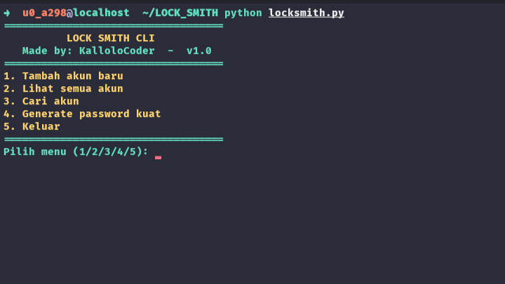

# LOCK_SMITH
LOCK_SMITH adalah aplikasi Password Manager berbasis CLI (Command Line Interface) yang ditulis dengan Python.
Aplikasi ini membantu kamu menyimpan akun, mencari akun, serta membuat 100 password kuat otomatis dengan kombinasi acak.

---

## Fitur Utama

- Tambah akun baru (nama akun, username, password).

- Lihat semua akun yang tersimpan di database.

- Cari akun tertentu berdasarkan nama.

- Generate 100 password kuat berdasarkan kata kunci (keyword).

---

## Instalasi

### 1. Clone repositori ini:
```
git clone https://github.com/KalloloCoder/LOCK_SMITH.git
cd LOCK_SMITH
```

### 2. Buat virtual environment (opsional, tapi disarankan):
```
python -m venv venv
source venv/bin/activate  # Linux/Mac
venv\Scripts\activate     # Windows
```

### 3. Install dependencies:
```
pip install colorama
(install juga Python ≥ 3.8)
```

---

## Cara Menjalankan

### 1. Jalankan script utama:
```
python locksmith.py
```

### 2. Akan muncul menu:



---

## Struktur File
```
LOCK_SMITH/
│
├── LICENSE          # Main program
├── README.md        # Database akun
├── locksmith.py     # Dokumentasi
├── passwords.json   # Lisensi
└── picture.png      #Gambar Screenshot
```

---

## Author

Created by [KalloloCoder](https://github.com/KalloloCoder)
